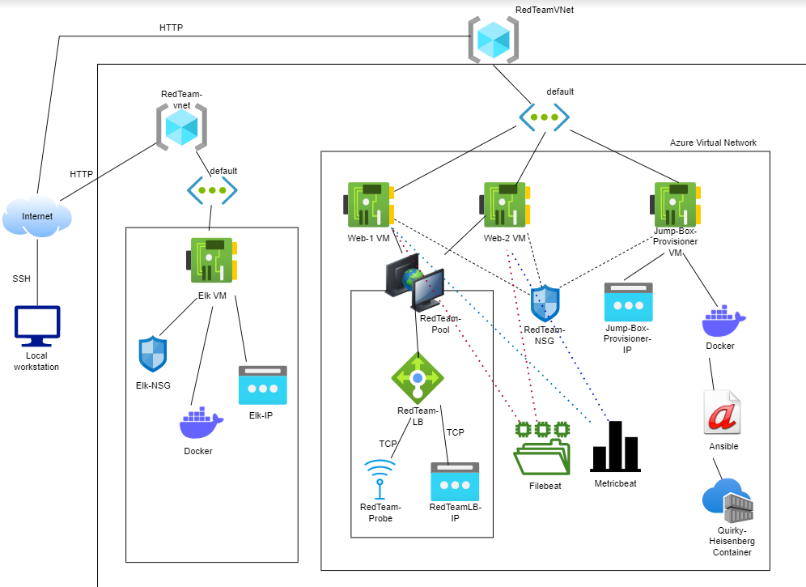
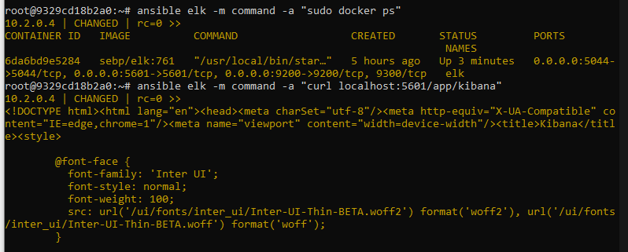

## Automated ELK Stack Deployment

The files in this repository were used to configure the network depicted below.

These files have been tested and used to generate a live ELK deployment on Azure. They can be used to either recreate the entire deployment pictured above. Alternatively, the files in the Ansible directory may be used to install only certain pieces of it, such as Filebeat.

  - 

This document contains the following details:
- Description of the Topologue
- Access Policies
- ELK Configuration
  - Beats in Use
  - Machines Being Monitored
- How to Use the Ansible Build

### Description of the Topology

The main purpose of this network is to expose a load-balanced and monitored instance of DVWA, the D*mn Vulnerable Web Application.

Load balancing ensures that the application will be highly responsive, in addition to restricting access to the network.
- _TODO: What aspect of security do load balancers protect? What is the advantage of a jump box?_

- *Load balancers* analayse incoming traffic and what server traffic is sent to, which protects against attacks such as denial of service (DDos) attacks. 
- *Jump boxes* limit access to your virtual network using private IPs of those machines.

Integrating an ELK server allows users to easily monitor the vulnerable VMs for changes to the logs and system traffic.
- _TODO: What does Filebeat watch for?_
- _TODO: What does Metricbeat record?_

- Filebeat generates and organises log files. When looking through log files, it can also look for changes in those files.
- Metricbeat records metrics from the operating system and services on the server.

The configuration details of each machine may be found below.
_Note: Use the [Markdown Table Generator](http://www.tablesgenerator.com/markdown_tables) to add/remove values from the table_.

| Name     | Function | IP Address | Operating System |
|----------|----------|------------|------------------|
| Jump Box | Gateway  | 10.0.0.1   | Linux            |
| Web-1    | Web server running DVWA         | 10.0.0.5   | Linux            |
| Web-2    | Web server running DVWA           | 10.0.0.6   | Linux            |
| Elk-VM   | Runs Elk container & Kibana          | 10.2.0.4   | Linux            |

### Access Policies

The machines on the internal network are not exposed to the public Internet. 

Only the Jump-Box-Provisioner machine can accept connections from the Internet. Access to this machine is only allowed from the following IP addresses:
- _TODO: Add whitelisted IP addresses_

Machines within the network can only be accessed by Jump-Box-Provisioner VM.
- _TODO: Which machine did you allow to access your ELK VM? What was its IP address?_

- The Jump-Box-Provisioner accessed my ELK VM and IP was 120.21.91.227. 

A summary of the access policies in place can be found in the table below.

| Name     | Publicly Accessible | Allowed IP Addresses |
|----------|---------------------|----------------------|
| Jump Box | Yes                 | 120.21.91.227
| Web-1    | No                  | 10.0.0.5,                       |
| Web-2    | No                  | 10.0.0.6                      |
| Elk      | Yes (via Port 5601)         | 120.21.91.227                     |
| Load Balancer  | Yes (via Port 80)                     | 120.21.91.227                     |
|          |                     |                      |

### Elk Configuration

Ansible was used to automate configuration of the ELK machine. No configuration was performed manually, which is advantageous because...
- _TODO: What is the main advantage of automating configuration with Ansible?_
- By using ansible to automate configuration of the ELK machine it streamlines the process and gives more control over the machine.

The playbook implements the following tasks:
- _TODO: In 3-5 bullets, explain the steps of the ELK installation play. E.g., install Docker; download image; etc._
- Elk playbook installs docker.io and Python on Elk VM
- Downloads, installs and executes Docker ELK container
- Set VM max count so VM doesn't crash

The following screenshot displays the result of running `docker ps` after successfully configuring the ELK instance.

### Target Machines & Beats
This ELK server is configured to monitor the following machines:
- _TODO: List the IP addresses of the machines you are monitoring_
- The Elk server monitors Web-1 and Web-2.

We have installed the following Beats on these machines:
- _TODO: Specify which Beats you successfully installed_
- Filebeat and Metricbeat were installed on these machines. 

These Beats allow us to collect the following information from each machine:
- _TODO: In 1-2 sentences, explain what kind of data each beat collects, and provide 1 example of what you expect to see. E.g., `Winlogbeat` collects Windows logs, which we use to track user logon events, etc._

- Filebeat generates and organises log files. When looking through log files, it can also look for changes in those files. E.g. in Filebeat, you can specify which container, beat, date, time range and argument you want to investigate.
- Metricbeat records metrics from the operating system and services on the server. Through Kibana, you can choose which system's metrics you would like to see.

### Using the Playbook
In order to use the playbook, you will need to have an Ansible control node already configured. Assuming you have such a control node provisioned: 

SSH into the control node and follow the steps below:
- Copy the my-playbook.yml file to elk.yml.
- Update the elk.yml file to include ports 5601, 9200 and 5044; name of container: elk; image: sebp/elk:761.
- Run the playbook, and navigate to Kibana to check that the installation worked as expected.

_TODO: Answer the following questions to fill in the blanks:_
- _Which file is the playbook? Where do you copy it?_
- _Which file do you update to make Ansible run the playbook on a specific machine? How do I specify which machine to install the ELK server on versus which to install Filebeat on?_
- _Which URL do you navigate to in order to check that the ELK server is running?_

- Playbook is in /etc/ansible/
- Added three IP addresses (Web-1, Web-2 and ELK). Then in the elk.yml file, specified where to install Elk.
- Used this URL to check ELK server was running: 20.83.126.58:5601/app/kibana

_As a **Bonus**, provide the specific commands the user will need to run to download the playbook, update the files, etc._